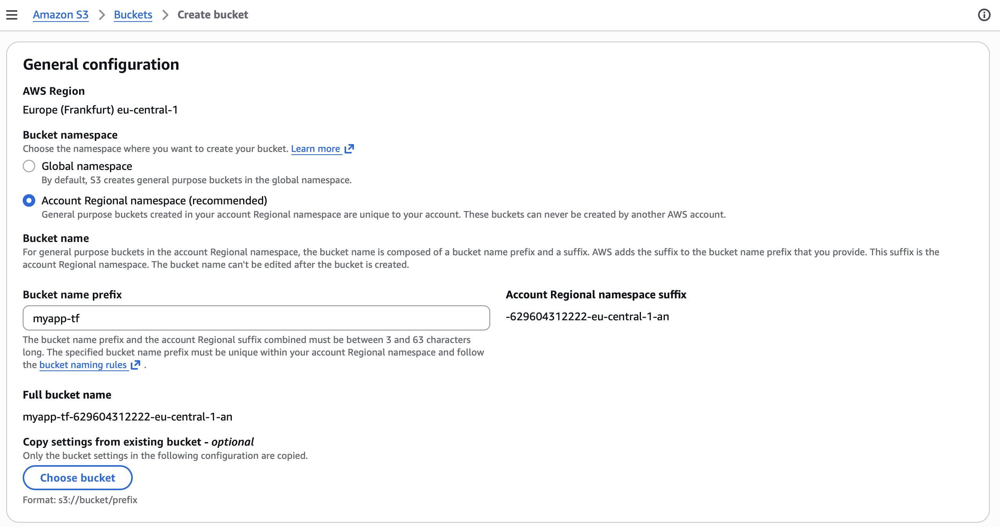
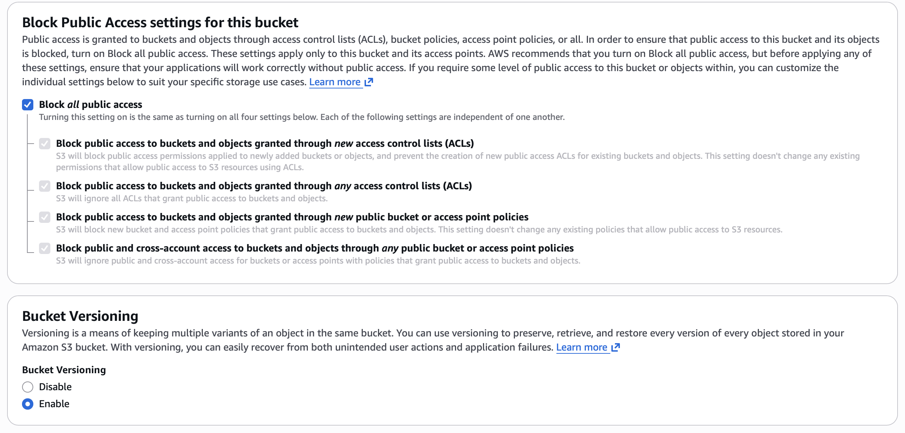
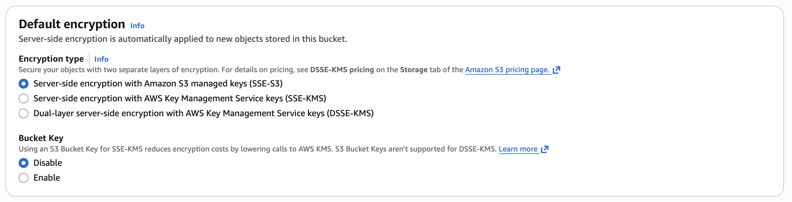
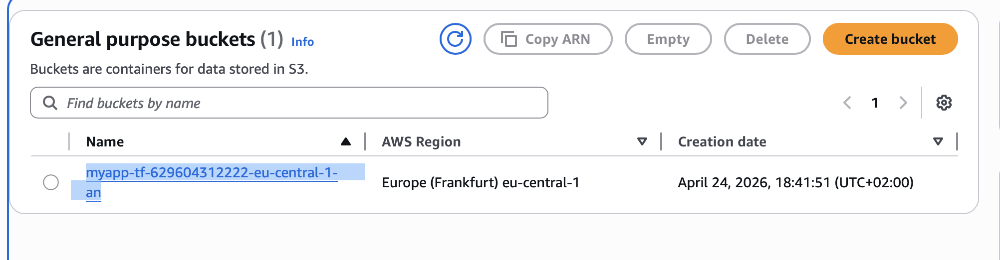

# Module 12 - Infrastructure as Code with Terraform

This repository contains a demo project created as part of my **DevOps studies** in the [TechWorld with Nana – DevOps Bootcamp](https://www.techworld-with-nana.com/devops-bootcamp).

**Demo Project:** Configure a Shared Remote State

**Technologies used:** Terraform, AWS S3

**Project Description:**

- Configure Amazon S3 as remote storage for Terraform state

---

### Prerequisites

Before starting, complete the following setup module:

Complete CI/CD with Terraform: https://github.com/explicit-logic/terraform-module-12.5

---

Overview


### Create AWS S3 Bucket

- Go to `Amazon S3` -> `Buckets`

- Create bucket

Name: `myapp-tf`

Bucket namespace: `Account Regional namespace`



Bucket Versioning: `Enable`



Encryption type: `Server-side encryption with Amazon S3 managed keys (SSE-S3)`

Bucket Key: `Disable`



- Create bucket

### Configure Remote Storage

Copy full bucket name (ex: `myapp-tf-629604312222-eu-central-1-an`)



Add to [main.tf](./terraform/main.tf)
```tf
terraform {
  required_version = ">= 0.12"
  backend "s3" {
    bucket = "full-bucket-name"
    key = "myapp/state.tfstate"
    region = "eu-central-1"
  }
}
```
