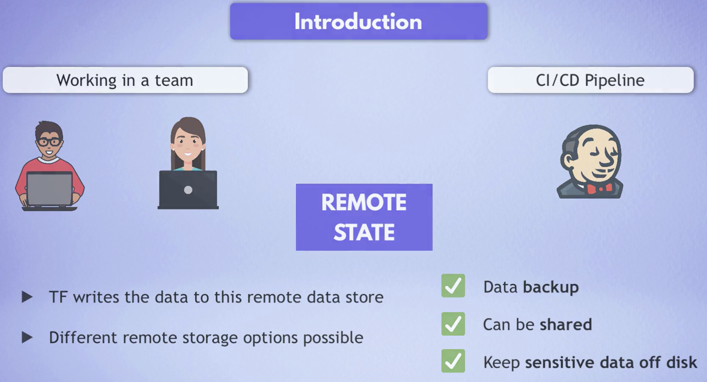

# Module 12 - Infrastructure as Code with Terraform

This repository contains a demo project created as part of my **DevOps studies** in the [TechWorld with Nana – DevOps Bootcamp](https://www.techworld-with-nana.com/devops-bootcamp).

**Demo Project:** Configure a Shared Remote State

**Technologies used:** Terraform, AWS S3

**Project Description:**

- Configure Amazon S3 as remote storage for Terraform state

---

### Prerequisites

Before starting, complete the following setup module:

Complete CI/CD with Terraform: https://github.com/explicit-logic/terraform-module-12.5

---

Overview

### Configure Remote Storage

