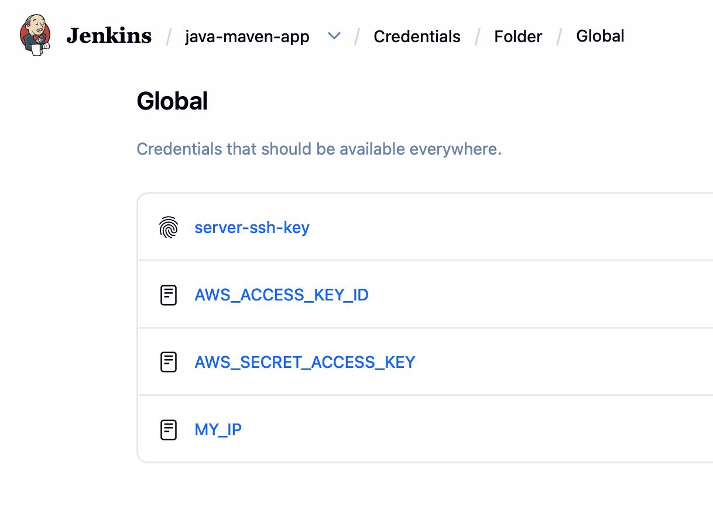
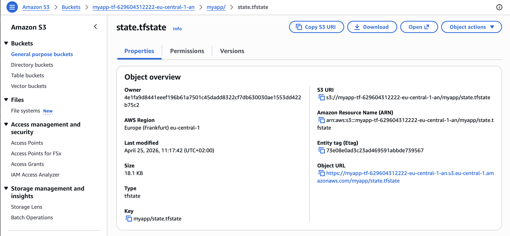
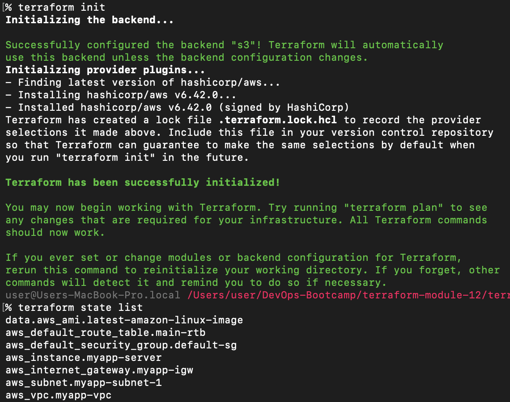

# Module 12 - Infrastructure as Code with Terraform

This repository contains a demo project created as part of my **DevOps studies** in the [TechWorld with Nana – DevOps Bootcamp](https://www.techworld-with-nana.com/devops-bootcamp).

**Demo Project:** Configure a Shared Remote State

**Technologies used:** Terraform, AWS S3

**Project Description:**

- Configure Amazon S3 as remote storage for Terraform state

---

## Prerequisites

Before starting, make sure the following setup module is complete:

- **CI/CD with Terraform:** [terraform-module-12.5](https://github.com/explicit-logic/terraform-module-12.5)

You will also need:

- An **AWS account** with permissions to create and manage S3 buckets
- A running **Jenkins** instance from the prerequisite module
- **Terraform** `>= 0.12` installed locally (for verifying state)

---

## Overview

By default, Terraform stores state locally in a `terraform.tfstate` file. This works for a single user, but breaks down quickly in a team or CI/CD setting because state cannot be shared safely and concurrent runs can corrupt it.

This project moves Terraform state into an **AWS S3 backend** so that:

- State is stored centrally and shared across the team and the CI/CD pipeline
- Versioning protects against accidental state loss
- Server-side encryption keeps sensitive values at rest secure
- Native S3 locking (`use_lockfile`) prevents concurrent `apply` operations from clobbering each other


---

## 1. Create the AWS S3 Bucket

This bucket will hold the remote Terraform state file.

1. Open the AWS console and navigate to **Amazon S3 → Buckets → Create bucket**.
2. Configure the following options:

   | Setting              | Value                                                            |
   | -------------------- | ---------------------------------------------------------------- |
   | **Name**             | `myapp-tf`                                                       |
   | **Bucket namespace** | `Account Regional namespace`                                     |
   | **Versioning**       | `Enable`                                                         |
   | **Encryption type**  | `Server-side encryption with Amazon S3 managed keys (SSE-S3)`    |
   | **Bucket Key**       | `Disable`                                                        |

> **Why versioning?** With versioning enabled, every change to the state file produces a new version, so a corrupted or accidentally deleted state can always be rolled back.


3. Click **Create bucket**.

---

## 2. Configure the Remote Backend

Once the bucket exists, copy its **full name** from the S3 console (for example: `myapp-tf-629604312222-eu-central-1-an`).


Add the `backend "s3"` block to [terraform/main.tf](./terraform/main.tf):

```hcl
terraform {
  required_version = ">= 0.12"

  backend "s3" {
    bucket       = "full-bucket-name"
    key          = "myapp/state.tfstate"
    region       = "eu-central-1"
    encrypt      = true
    use_lockfile = true
  }
}
```

| Field          | Purpose                                                                           |
| -------------- | --------------------------------------------------------------------------------- |
| `bucket`       | The S3 bucket created in step 1 (replace `full-bucket-name` with your value).     |
| `key`          | Object path inside the bucket where the state file is stored.                     |
| `region`       | AWS region of the bucket — must match the bucket's region.                        |
| `encrypt`      | Forces server-side encryption when uploading state.                               |
| `use_lockfile` | Enables S3-native state locking, removing the need for a separate DynamoDB table. |

---

## 3. Launch the Pipeline

The Jenkins pipeline runs `terraform init/apply` against the new remote backend. It needs your public IP to whitelist SSH access to the provisioned EC2 instance.

### 3.1 Get your public IP

```sh
curl https://ipinfo.io/ip
```

### 3.2 Add the IP as a Jenkins credential

1. Go to **`java-maven-app` → Credentials → Global → Add Credentials**.
2. Choose **Secret text** and use the following values:

   - **ID:** `MY_IP`
   - **Secret:** `<your public IP>`

The final list of pipeline credentials should look like this:



### 3.3 Run the pipeline

Trigger the Jenkins job and watch the stages execute end-to-end:


---

## 4. Verify the Remote State

After the pipeline finishes, a `tfstate` file should appear inside the S3 bucket:



To confirm that your local Terraform CLI can read the same remote state, run from the [terraform/](./terraform) directory:

```sh
terraform init
terraform state list
```

`terraform init` detects the new `backend "s3"` block and pulls the state from S3. `terraform state list` then prints every resource currently tracked — proving the local CLI and the Jenkins pipeline are now operating on the same shared state.


